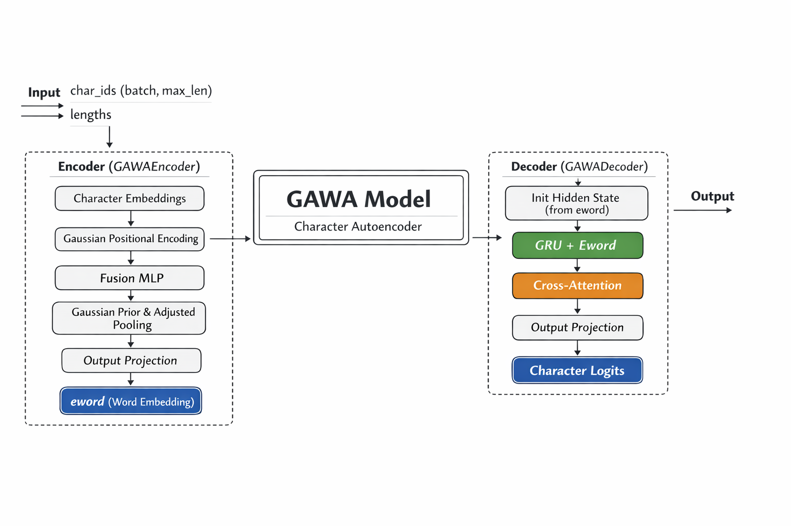

# GAWA — Gaussian-Weighted Abstraction for Word Architecture

<div align="center">

<!-- Connect -->
[](https://huggingface.co/AiRukua)
[](https://id.linkedin.com/in/abdul-wahid-rukua)
[](https://www.python.org/)
[](https://pytorch.org/)

<!-- Platform -->
[](https://www.kaggle.com/AiRukua)
[](https://github.com/AiRukua)
[](https://colab.research.google.com/)
[](https://wandb.ai/AiRukua)

<!-- GitHub Stats -->


</div>



## Overview

**GAWA** is a word-level morphological autoencoder that encodes any word — including unseen or morphologically complex words — into a dense embedding vector (`eword`) using character-level representations weighted by a **Gaussian positional prior**.

Unlike subword tokenizers (BPE, WordPiece, SentencePiece), GAWA treats each word as a sequence of characters and compresses it into a single fixed-size vector. This makes it:

- **Language-agnostic**: Works on any character-based language without a pretrained vocabulary
- **Morphology-aware**: Positional weighting captures prefix/suffix importance naturally
- **Compact**: The output sequence length equals the number of words, not subword tokens

GAWA is designed to plug in as the **front-end morphological module** of a Global Transformer, replacing the tokenizer entirely.


## OOV Similarity (Indonesian)

GAWA can **distinguish words by morphological footprint** and still place
misspellings or variants near their correct forms. Below are examples of
OOV (out-of-vocabulary) queries from Indonesian words.

```
OOV: makann
  makanan       sim=0.9846
  makan         sim=0.9779
  mkan          sim=0.8618

OOV: mkan
  mknn          sim=0.8653
  makan         sim=0.8627
  makann        sim=0.8618

OOV: berlarr
  berlari       sim=0.9857
  permaenan     sim=0.5540
  permainan     sim=0.4860

OOV: permaenan
  permainan     sim=0.9255
  memakan       sim=0.5783
  berlarr       sim=0.5540
```

The pretrained model was trained on **Indonesian language data**
(~8.2 million unique words extracted from Indo4B: https://huggingface.co/datasets/taufiqdp/Indo4B).

## Training Details

- **Decoder training**: 2 epochs
- **Accuracy**: 94%
- **Dataset**: ~8.2 million words extracted from Indo4B
- **Training time**: ~12 hours
- **Hardware**: NVIDIA T4 (Kaggle)


## Architecture

```
Input Word (characters)
        │
        ├──► Char Embedding  (trainable)
        │
        ├──► Gaussian Positional Encoding  (fixed, non-trainable)
        │         μ_j = j,   σ_j = √j
        │
        └──► Concat → Fusion MLP
                          │
                    Weighted Pooling
                    (Gaussian Prior + Learnable Δ)
                          │
                    Output Projection
                          │
                       EWORD Vector  ──────────────────────────┐
                                                               │
                                                    ┌──────────▼──────────┐
                                                    │    GAWA Decoder     │
                                                    │  Init GRU Hidden    │
                                                    │  Char Emb + Concat  │
                                                    │  GRU Cell           │
                                                    │  Cross-Attention    │
                                                    │  Residual + Logits  │
                                                    └─────────────────────┘
```


## Installation

### 1. Install via GitHub (pip)

```bash
pip install git+https://github.com/AiRukua/gawa.git
```

### 2. Local Development Install

```bash
git clone https://github.com/AiRukua/gawa.git
cd gawa
pip install -e .
```

### 3. Optional Dev Dependencies

```bash
pip install -e ".[dev]"
```


## Quick Start (CLI)

### 1. Prepare Data

GAWA expects a **word list** (one word per line). You can build it from raw text:

```bash
gawa-prepare --input data/raw.txt --output data/processed/train.txt --lower
```

### 2. Train

Use the YAML configs in `configs/`:

```bash
gawa-train --config configs/gawa_small.yaml
```

Checkpoints are saved to the directory defined in the config (default: `checkpoints/`).

### 3. Encode Word Embeddings

```bash
gawa-encode \
  --checkpoint checkpoints/gawa_small/best.pt \
  --words "makan,memakan,makanan"
```

Default output is JSONL. Use `--output` to write to a file.

### 4. Evaluate / Reconstructions

```bash
gawa-evaluate --config configs/gawa_small.yaml --checkpoint checkpoints/gawa_small/best.pt
```


## Quick Start (Python - Training)

```python
from gawa import load_config, train_from_config

# 1) Load YAML config
cfg = load_config("configs/gawa_small.yaml")

# 2) Train from config (checkpoints saved to the directory in the YAML)
train_from_config(cfg)
```


## Pretrained Model (Hugging Face)

If you want to use the **pretrained GAWA model**, you can load it directly from
Hugging Face:

```python
from gawa import GAWAModel

model = GAWAModel.from_pretrained("AiRukua/gawa")

kept_words, embs = model.encode_words(["makan", "memakan", "makanan"])
kept_words, recs = model.decode_words(["makan", "memakan", "makanan"])
```

## Config Guide (YAML)

GAWA uses a YAML config file for training (see `configs/`). The key sections are:

**`data`**
- `train_path`: Path to a text file with one word per line.
- `max_word_len`: Maximum word length (characters). Words longer than this are filtered.

**`model`**
- `char_emb_dim`: Character embedding dimension.
- `pos_enc_dim`: Gaussian positional encoding dimension.
- `hidden_dim`: Fusion MLP & decoder GRU hidden size.
- `eword_dim`: Output word embedding dimension.
- `max_word_len`: Must match `data.max_word_len`.
- `encoder_lambda_adjust`: Weight for learnable position delta.
- `decoder_num_layers`: Number of GRU layers in the decoder.
- `decoder_num_heads`: Number of cross-attention heads.

**`training`**
- `batch_size`: Training batch size.
- `epochs`: Number of training epochs.
- `lr`: Learning rate.
- `sample_every`: How often to log reconstructions.

Example snippet:

```yaml
data:
  train_path: data/processed/train.txt
  max_word_len: 32

model:
  char_emb_dim: 64
  pos_enc_dim: 64
  hidden_dim: 256
  eword_dim: 768
  max_word_len: 32
  encoder_lambda_adjust: 0.3
  decoder_num_layers: 1
  decoder_num_heads: 2

training:
  batch_size: 256
  epochs: 20
  lr: 3.0e-4
  sample_every: 1
```

To train with your config:

```bash
gawa-train --config configs/gawa_small.yaml
```

## Model Dimensions

| Parameter         | Default | Description                          |
|-------------------|---------|--------------------------------------|
| `char_emb_dim`    | 64      | Character embedding size             |
| `pos_enc_dim`     | 64      | Gaussian PE dimension                |
| `hidden_dim`      | 256     | Fusion MLP & GRU hidden size         |
| `eword_dim`       | 768     | Output word embedding dimension      |
| `max_word_len`    | 32      | Maximum word length in characters    |
| `lambda_adjust`   | 0.3     | Weight of learnable position delta   |


## Why GAWA?

| Feature                        | BPE / WordPiece | GAWA           |
|-------------------------------|-----------------|----------------|
| Handles unseen words           | ✗ (UNK/fallback) | ✓ (char-based) |
| Morphology-aware               | Partial          | ✓ Explicit     |
| Sequence length                | Longer (subwords)| Shorter (words) |
| Language-specific vocab needed | ✓               | ✗              |
| Trainable end-to-end           | ✓               | ✓              |
| Positional character weighting | ✗               | ✓ Gaussian     |


## Project Structure

- `model/`: Encoder, decoder, and core model.
- `training/`: Training loop, scheduler, and checkpointing.
- `data/`: Data prep utilities.
- `eval/`: Evaluation and encoding helpers.
- `scripts/`: CLI entrypoints.
- `configs/`: YAML configuration examples.


## License

MIT License. See `LICENSE` for details.
