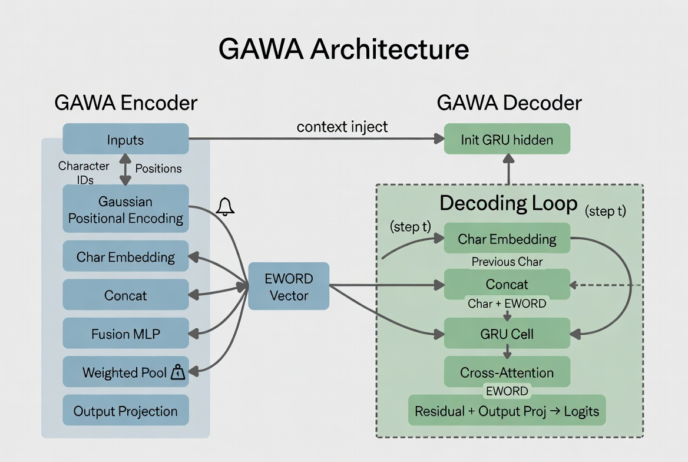

# GAWA — Gaussian-Weighted Abstraction for Word Architecture



> A morphological character-level encoder/decoder with Gaussian positional encoding,  
> designed as a front-end module for large language models.

[](https://huggingface.co/AiRukua)
[](https://id.linkedin.com/in/abdul-wahid-rukua)
[](https://www.python.org/)
[](https://pytorch.org/)

---

## Overview

**GAWA** is a word-level morphological autoencoder that encodes any word — including unseen or morphologically complex words — into a dense embedding vector (`eword`) using character-level representations weighted by a **Gaussian positional prior**.

Unlike subword tokenizers (BPE, WordPiece, SentencePiece), GAWA treats each word as a sequence of characters and compresses it into a single fixed-size vector. This makes it:

- **Language-agnostic**: Works on any character-based language without a pretrained vocabulary
- **Morphology-aware**: Positional weighting captures prefix/suffix importance naturally
- **Compact**: The output sequence length equals the number of words, not subword tokens

GAWA is designed to plug in as the **front-end morphological module** of a Global Transformer, replacing the tokenizer entirely.

---

## Architecture

```
Input Word (characters)
        │
        ├──► Char Embedding  (trainable)
        │
        ├──► Gaussian Positional Encoding  (fixed, non-trainable)
        │         μ_j = j,   σ_j = √j
        │
        └──► Concat → Fusion MLP
                          │
                    Weighted Pooling
                    (Gaussian Prior + Learnable Δ)
                          │
                    Output Projection
                          │
                       EWORD Vector  ──────────────────────────┐
                                                               │
                                                    ┌──────────▼──────────┐
                                                    │    GAWA Decoder     │
                                                    │  Init GRU Hidden    │
                                                    │  Char Emb + Concat  │
                                                    │  GRU Cell           │
                                                    │  Cross-Attention    │
                                                    │  Residual + Logits  │
                                                    └─────────────────────┘
```

---

## Installation

### 1. Install via GitHub (pip)

```bash
pip install git+https://github.com/AiRukua/gawa.git
```

### 2. Local Development Install

```bash
git clone https://github.com/AiRukua/gawa.git
cd gawa
pip install -e .
```

### 3. Optional Dev Dependencies

```bash
pip install -e ".[dev]"
```

---

## Quick Start (CLI)

### 1. Prepare Data

GAWA expects a **word list** (one word per line). You can build it from raw text:

```bash
gawa-prepare --input data/raw.txt --output data/processed/train.txt --lower
```

### 2. Train

Use the YAML configs in `configs/`:

```bash
gawa-train --config configs/gawa_small.yaml
```

Checkpoints are saved to the directory defined in the config (default: `checkpoints/`).

### 3. Encode Word Embeddings

```bash
gawa-encode \
  --checkpoint checkpoints/gawa_small/best.pt \
  --words "makan,memakan,makanan"
```

Default output is JSONL. Use `--output` to write to a file.

### 4. Evaluate / Reconstructions

```bash
gawa-evaluate --config configs/gawa_small.yaml --checkpoint checkpoints/gawa_small/best.pt
```

---

## Quick Start (Python)

```python
from gawa import encode_words, load_config, train_from_config

cfg = load_config("configs/gawa_small.yaml")
train_from_config(cfg)

kept_words, embeddings = encode_words(
    checkpoint_path="checkpoints/gawa_small/best.pt",
    words=["makan", "memakan", "makanan"],
)
print(embeddings.shape)
```

---

## Model Dimensions

| Parameter         | Default | Description                          |
|-------------------|---------|--------------------------------------|
| `char_emb_dim`    | 64      | Character embedding size             |
| `pos_enc_dim`     | 64      | Gaussian PE dimension                |
| `hidden_dim`      | 256     | Fusion MLP & GRU hidden size         |
| `eword_dim`       | 768     | Output word embedding dimension      |
| `max_word_len`    | 32      | Maximum word length in characters    |
| `lambda_adjust`   | 0.3     | Weight of learnable position delta   |

---

## Why GAWA?

| Feature                        | BPE / WordPiece | GAWA           |
|-------------------------------|-----------------|----------------|
| Handles unseen words           | ✗ (UNK/fallback) | ✓ (char-based) |
| Morphology-aware               | Partial          | ✓ Explicit     |
| Sequence length                | Longer (subwords)| Shorter (words) |
| Language-specific vocab needed | ✓               | ✗              |
| Trainable end-to-end           | ✓               | ✓              |
| Positional character weighting | ✗               | ✓ Gaussian     |

---

## Project Structure

- `model/`: Encoder, decoder, and core model.
- `training/`: Training loop, scheduler, and checkpointing.
- `data/`: Data prep utilities.
- `eval/`: Evaluation and encoding helpers.
- `scripts/`: CLI entrypoints.
- `configs/`: YAML configuration examples.

---

## License

MIT License. See `LICENSE` for details.

---

## Author

**Abdul Wahid Rukua**  
🤗 HuggingFace: AiRukua  
LinkedIn: Abdul Wahid Rukua
